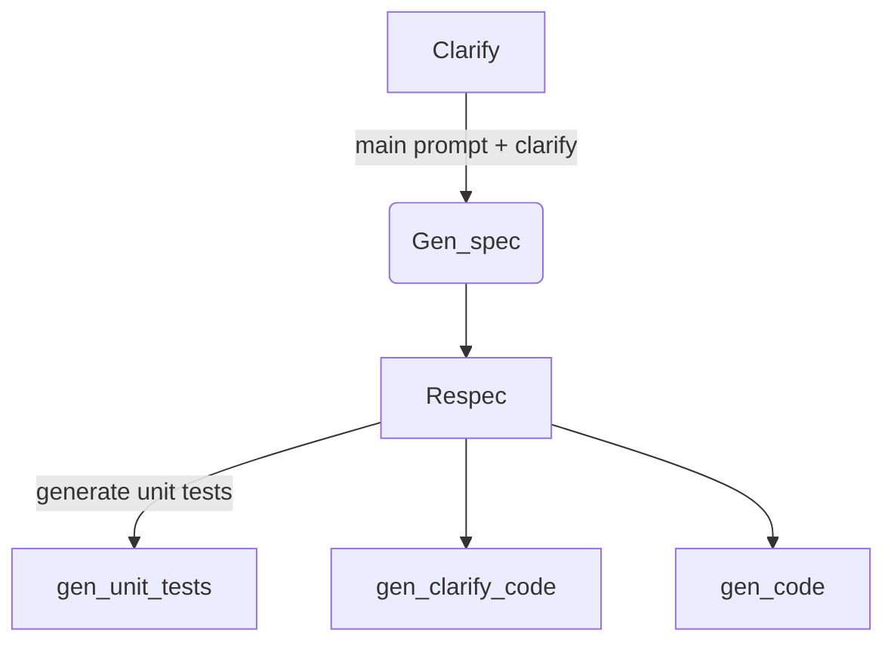

## 开始之前

所谓 Prompt Engineering（提示工程），就是与 AI 进行有效沟通以**实现预期效果**的过程。至于为什么需要 PE 及其相关原理，并不是这篇文章的重点，感兴趣的同学可以看这篇文章[^1]。

本文想要介绍在提示工程中，一些对于开发者有用的技巧[^2]，以及分析在开源项目中的具体应用。

## 一些技巧

### 编写明确具体的说明

#### 使用分隔符

分隔符可以是任何形式，例如：

```js
'''text'''

"""text"""

< text >

<tag>text</tag>
```

```js
const text = `
通过提供尽可能明确和具体的说明来表达你希望模型执行的任务。
这将引导模型朝着预期的输出方向发展，并减少收到无关或不正确回复的可能性。
不要混淆编写清晰提示和编写简短提示。
在大多数情况下，
较长的提示可以为模型提供更明确的上下文，从而产生更详细和更具相关性的输出结果。
`

const prompt = `
将三个双引号括起来的文本总结为一句话。
"""${text}"""
`
```

#### 结构化输出

比如输出形式为 JSON 或 HTML

```js
const prompt = `
生成三本虚构类书籍的书名、作者和类型列表。 
使用以下键以 JSON 格式提供：book_id、title、author、genre。
`
```

#### 检查条件是否满足

```js
const text = `
泡一杯茶很容易！首先，需要烧一些水。 
在水烧开的时候，拿一个杯子并把一个茶包放进去。 
然后把开水倒在茶包上。 
让它浸泡一会儿，茶就可以泡好了。 
几分钟后，取出茶包。如果你喜欢，还可以加一些糖或牛奶。 
就这样！你可以享受泡好的茶水了。
`

const prompt = `
如果文本包含一系列说明，请按以下格式重新编写这些说明：

步骤1 - ...
步骤2 - ...
...
步骤N - ...

如果文本不包含一系列说明，则仅写“未提供步骤”。

"""${text}"""
`
```

#### 「Few-shot」 提示

「Few-shot」提示[^3]是指向 AI 模型提供有限数量的示例，从而引导模型更好地执行任务。这是一种常用于训练大语言模型（LLMs）的技术。

Few-shot prompting 的步骤如下：

1. 选择你想让模型生成响应的领域或主题。可以是一种文本类型、语言方式等。

2. 为模型提供少量的示例（提示），以作为后续样例的条件。通常只需提供 2-5 个示例即可进行「few-shot」学习。

3. 模型将分析提示中的模式、风格和结构。它将学习定义该领域响应的属性。

4. 让模型在相同领域中生成新的响应。通过提示的条件化，它可以生成符合所需风格、结构等的响应。

5. 评估响应并提供反馈以进一步改进模型。这可以是直接反馈给模型，也可以只是记录下一组提示生成的领域中需要改进的地方。

### 给模型时间「思考」

#### 指定完成任务所需的步骤

```js
const text = `
在一个美丽的村庄里，有一对兄妹杰克和吉尔。一天他们出发去从山顶的井中取水，
当他们欢快地唱着歌爬山时，不幸降临了——杰克被石头绊倒了，滚下山坡，吉尔也跟着摔了下来。 
虽然受了轻伤，万幸两人还是平安回家了。尽管发生了不幸，但他们的冒险精神却丝毫没有减弱，他们将继续探索大自然。
`

// 示例
const prompt = `
执行以下操作：
1-请使用一句话概括给出的文本内容。
2-将摘要翻译成法语。
3-列出法语摘要中的每个名称。
4-输出一个包含以下键的 json 对象：french_summary，num_names。

请使用换行符给出答案。

文本：
"""${text}"""
`
```

#### 指示模型在决定之前先自行解决问题

```js
const prompt = `
你的任务是确定学生的解决方案是否正确。
要解决问题，请执行以下操作：
-首先，自己解决问题。
-然后将你的解决方案与学生的解决方案进行比较，并评估学生的解决方案是否正确。
在自己解决问题之前，请不要决定学生的解决方案是否正确。

使用以下格式：

问题：

"""
问题
""

学生的解决方案：

"""
学生的解决方案
"""

实际解决方案：

"""
解决方案的步骤和您的解决方案在这里
"""

学生的解决方案是否与刚刚计算出的实际解决方案相同：

""
是或否
"""

学生的成绩：

"""
正确或不正确
"""

问题：

"""
我正在建造一个太阳能电站，我需要帮助解决财务问题。
-土地成本为每平方英尺100美元
-我可以以每平方英尺250美元的价格购买太阳能电池板
-我协商了一个维护合同，每年将花费固定的10万美元，以及额外的每平方英尺10美元
请计算出第一年的总成本是多少。
"""

学生的解决方案：

"""
设x为安装面积（以平方英尺为单位）。
成本：
1.土地成本：100x
2.太阳能电池板成本：250x
3.维护成本：100,000+100x
总成本：100x+250x+100,000+100x=450x+100,000
"""

实际解决方案：
`
```

## 他山之石

### ai-code-translator

这个项目[^4]可以在不同的编程语言环境下转换代码。使用到了前面提到过的一些技巧，如使用分隔符来指示输入和输出的编程语言、提供「Few-shot」提示等。

```js
const prompt = `
You are an expert programmer in all programming languages. Translate the "${inputLanguage}" code to "${outputLanguage}" code. Do not include \`\`\`.
  
      Example translating from JavaScript to Python:
  
      JavaScript code:
      for (let i = 0; i < 10; i++) {
        console.log(i);
      }
  
      Python code:
      for i in range(10):
        print(i)
      
      ${inputLanguage} code:
      ${inputCode}

      ${outputLanguage} code (no \`\`\`):
     `;
`
```

### gpt-engineer

我们再来看一个更复杂的项目——基于描述来生成整个完整代码库，其中[^5]使用了大量的 propmts。下面列举部分步骤，来分析该步骤中使用到的 prompt。



```js
const prompt_on_respec = `
You are a pragmatic principal engineer at Google.
You have been asked to review a specification for a new feature by a previous version of yourself

You have been asked to give feedback on the following:
- Is there anything that might not work the way intended by the instructions?
- Is there anything in the specification missing for the program to work as expected?
- Is there anything that can be simplified without significant drawback?

You are asked to make educated assumptions for each unclear item.
For each of these, communicate which assumptions you'll make when implementing the feature.

Think step by step to make sure we don't miss anything.
`
```

```js
const prompt_on_gen_code = `
Please now remember the steps:

Think step by step and reason yourself to the right decisions to make sure we get it right.
First lay out the names of the core classes, functions, methods that will be necessary, As well as a quick comment on their purpose.

Then you will output the content of each file including ALL code.
Each file must strictly follow a markdown code block format, where the following tokens must be replaced such that
FILENAME is the lowercase file name including the file extension,
LANG is the markup code block language for the code's language, and CODE is the code:

FILENAME
CODE

Please note that the code should be fully functional. No placeholders.

You will start with the "entrypoint" file, then go to the ones that are imported by that file, and so on.
Follow a language and framework appropriate best practice file naming convention.
Make sure that files contain all imports, types etc. The code should be fully functional. Make sure that code in different files are compatible with each other.
Before you finish, double check that all parts of the architecture is present in the files.
`
```

[^1]: [How ChatGPT works: a deep dive](https://typefully.com/DanHollick/yA3ppZC)
[^2]: 本文的主要示例来自 [deeplearning.ai](https://learn.deeplearning.ai/chatgpt-prompt-eng/)
[^3]: [Few-Shot Prompting](https://www.promptingguide.ai/techniques/fewshot)
[^4]: [ai-code-translator](https://github.com/mckaywrigley/ai-code-translator/tree/main)
[^5]: [gpt-engineer](https://github.com/AntonOsika/gpt-engineer)
