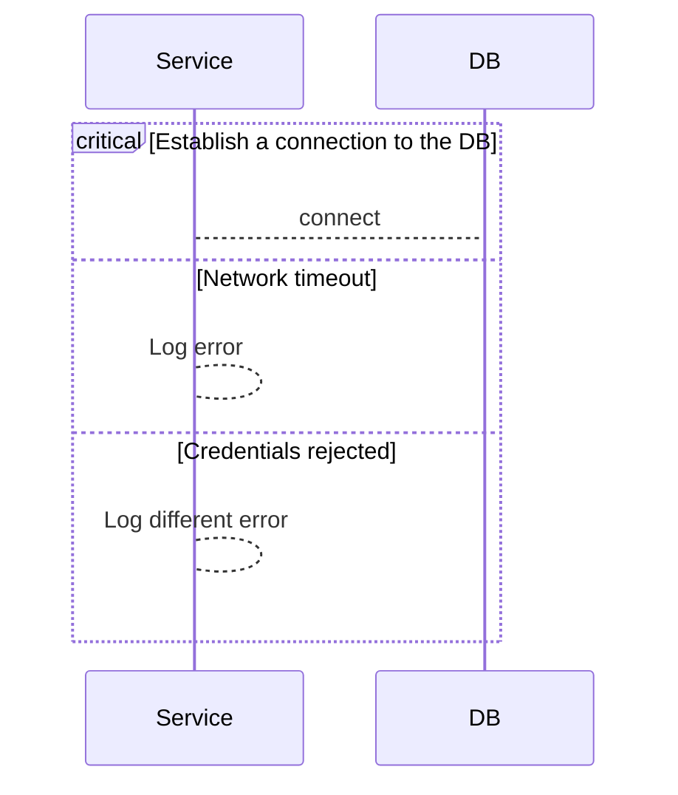

import { Callout } from 'fumadocs-ui/components/callout';
import { Tab, Tabs } from 'fumadocs-ui/components/tabs';

<Callout type="info">
本项目已开源，欢迎 Star：[GitHub 仓库链接](https://github.com/occupy5/blog)
</Callout>


## 前言

写博客这件事，算起来已经进行了快十年。

最早是在 2017 年，使用 **Hexo** 搭建了第一个个人网站，那时候最大的乐趣就是魔改各种主题配置和折腾插件。后来到了 2023 年，为了探索去中心化写作，迁移到了链上博客 **xLog**。

遗憾的是，现在 xLog 已经停止维护。于是，我决定开启新一轮的“造轮子”工程——重构博客。

## 遇见 Fumadocs

关于博客的选型有太多太多的方案，我最终选择了 [Fumadocs](https://www.fumadocs.dev/docs)。它本质上是一个基于 Next.js 的文档框架，但其**极高的定制性**和优秀的**交互设计**，非常适合用来构建一个“开发者友好”的技术博客。

### 1. 极致的代码阅读体验

Fumadocs 深度集成了 **Shiki** 和 **Twoslash**，带来了 IDE 级别的阅读体验。

#### Shiki Transformers

```tsx
// highlight a line
<div>Hello World</div> // [!code highlight]

// highlight a word
// [!code word:Fumadocs]
<div>Fumadocs</div>

// diff styles
console.log('hewwo'); // [!code --]
console.log('hello'); // [!code ++]

// focus
return new ResizeObserver(() => {}) // [!code focus]
```

#### Twoslash 静态类型检查

不再是简单的颜色高亮，现在支持静态类型检查。将鼠标悬停在下方的 `user` 变量上，可以直接查看 TypeScript 的类型定义。

```ts twoslash
interface User {
  id: number;
  username: string;
  role: 'admin' | 'user';
}

const user: User = {
  id: 1,
  username: "Fumadocs",
  role: "admin",
};

// 悬停在 user 上查看类型推导
console.log(user.role);

```

### 2. 代码驱动的可视化

得益于 MDX 的强大能力，图表与公式不再依赖截图，而是成为可维护的代码片段。

#### Mermaid 流程图

直接在 Markdown 中描述业务逻辑，对于解释技术架构非常有用。



#### KaTeX 数学公式

原生支持复杂的数学符号渲染，保持排版的一致性与优雅。

Attention 机制公式：

$$\text{Attention}(Q, K, V) = \text{softmax}\left(\frac{QK^T}{\sqrt{d_k}}\right)V$$

### 3. 极简设计

摒弃视觉噪音，**内容优先**是唯一原则。

* **字体**：正文采用 **Geist Sans**，代码采用 **JetBrains Mono**。几何无衬线体与等宽字体的组合，保证了长时间阅读的舒适度。
* **深色模式**：基于 **Tailwind CSS v4** 的语义化配置，实现了丝滑的明暗切换。
* **移动优先**：对于移动端视口进行了适配，保证在任何设备上都能获得一致的阅读体验。

### 4. 技术栈

| 核心组件 | 技术选型 | 优势 |
| --- | --- | --- |
| **框架** | Next.js 16 | App Router + RSC 带来的极致首屏性能 |
| **运行时** | Bun | 依赖安装与冷启动速度比 Node.js 快数倍 |
| **规范** | Biome | 单一工具链替代 ESLint + Prettier，速度飞快 |
| **搜索** | Fumadocs Search | 纯本地全文搜索，无外部依赖 |

### 沉浸式写作

建议在 .vscode/settings.json 中添加以下配置：

```json
"[mdx]": {
        "editor.lineHeight": 28,// [!code ++]
        "editor.wordWrap": "wordWrapColumn",// [!code ++]
        "editor.wordWrapColumn": 85,// [!code ++]

        "editor.lineNumbers": "off",// [!code ++]
        "editor.minimap.enabled": false,// [!code ++]
        "editor.glyphMargin": false, // [!code ++]
        "editor.renderWhitespace": "none",// [!code ++]
    },
```


## 结语

折腾博客的尽头是回归内容。

Fumadocs 提供了一个足够现代、高性能且低维护成本的地基。接下来的日子，希望自己多写点东西。
