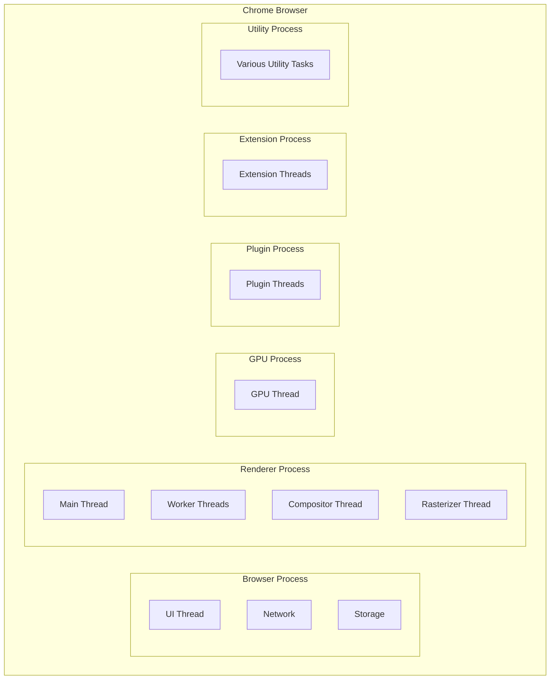

## 从几个问题开始

+ 用户在地址栏输入 URL 后，浏览器导航到网页的流程是怎样的
+ 渲染器进程的核心工作是什么？它如何将 HTML、CSS 和 JavaScript 转化为可视网页
+ 作为一名 Web 开发者，有哪些工具和实践可以帮助我优化网页性能

## 多进程架构

> 操作系统之上的操作系统

### 各个进程的作用

#### 浏览器进程

+ **核心协调者**：浏览器进程是应用程序的“指挥中心”，负责协调其他进程，处理标签页以外的所有浏览器事务。
+ **用户界面 (UI) 控制**：它控制浏览器应用程序的“Chrome”部分，包括地址栏、书签以及前进和后退按钮。其中的 *UI 线程* 负责绘制这些浏览器按钮和输入字段
+ **网络请求处理**：浏览器进程中的 *网络线程* 专门负责与网络堆栈交互，从互联网接收数据，处理 DNS 查询、建立 TLS 连接等协议，并处理服务器重定向。它还会执行 SafeBrowsing 检查以防止用户访问恶意站点，以及跨域读取阻塞 (CORB) 检查以保护敏感的跨站点数据。
+ **文件和存储访问**：它处理浏览器中“不可见、特权”的部分，例如文件访问，由其内部的 *存储线程* 负责
+ **导航流程管理**：从用户在地址栏输入 URL 到页面开始渲染，整个导航流程由**浏览器进程**协调。它会寻找或启动一个**渲染器进程**来渲染网页，并通过 IPC (进程间通信) 提交导航
+ **Service Worker 识别**：当导航请求传入时，*网络线程*会检查请求的域名是否与已注册的 Service Worker 作用域匹配。如果匹配，UI 线程会启动一个**渲染器进程**来执行 Service Worker 代码
+ 输入事件处理：用户手势（如触摸或鼠标点击）首先由**浏览器进程**接收。由于标签页内的内容由**渲染器进程**处理，浏览器进程会将事件类型和坐标发送给**渲染器进程**
  
#### 渲染进程

+ **网页内容显示**：渲染器进程控制着标签页内显示网站内容的全部区域
+ **核心渲染工作**：其核心任务是将 HTML、CSS 和 JavaScript 转换为用户可以交互的网页。这包括解析 HTML 构建 DOM、解析 CSS 计算样式、执行布局以确定元素的几何形状、生成绘制记录以及将页面分层并进行合成
+ **主线程**：渲染器进程的主线程处理大部分发送给用户的代码，包括 HTML 解析、样式计算、布局、生成绘制记录以及 JavaScript 执行
+ **工作线程**：如果使用了 Web Worker 或 Service Worker，部分 JavaScript 代码会由渲染器进程中的 *工作线程* 处理
+ **合成器线程和栅格线程**：为了高效平滑地渲染页面，渲染器进程内部还运行着 *合成器线程* (Compositor thread) 和 *栅格线程* (Raster threads)。*合成器线程*负责将页面分成层，*栅格线程*将这些层分解成图块并栅格化存储到 GPU 内存中，合成器线程再将它们合成一个帧
+ **Service Worker 执行**：Service Worker 是运行在渲染器进程中的 JavaScript 代码

#### GPU 进程

+ **处理 GPU** 任务：它独立于其他进程处理 GPU 任务。将其分离为单独的进程是因为 GPU 会处理来自多个应用程序的请求并在同一表面上绘制它们。最终的合成器帧会发送到 GPU 进行显示

#### 插件进程

+ **控制插件**：它控制网站使用的任何插件，例如 Flash
  
#### 其他进程

+ **扩展进程** (Extension Process)：处理浏览器扩展程序的功能
+ **实用工具进程** (Utility Processes)：处理其他各种辅助任务

### 多进程架构的好处

+ **提高稳定性**：如果一个标签页变得无响应，只会影响该标签页所在的渲染器进程，而不会导致整个浏览器崩溃或所有标签页都无响应

+ **增强安全性和沙盒化**：操作系统提供了限制进程权限的机制，浏览器可以对渲染器进程等处理用户输入的进程进行沙盒化，限制它们对文件等特定功能的访问，从而提高了整体安全性。站点隔离 (Site Isolation) 功能进一步增强了安全性，它为每个跨站 iframe 运行一个独立的渲染器进程，是分离站点的最有效方式

+ **服务化** (Servicification)：Chrome 正在将浏览器程序的各个部分作为服务运行。在强大硬件上，每个服务可以拆分为不同的进程以提供更高的稳定性；在资源受限设备上，这些服务可以整合到一个进程中以节省内存占用

## 相关文章

+ [Inside look at modern web browser](https://developer.chrome.com/blog/inside-browser-part1)
